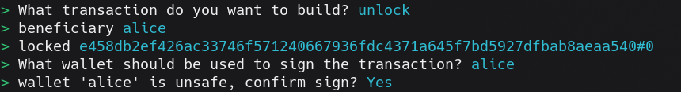

# Order Book example
An order swap contract enables peer-to-peer exchanges of assets without the intervention of third parties. A user (the Maker) creates an order by locking some asset and specifying in the datum:

- What asset they want and how much they want

- Who should receive it (a Recipient)

Another user (the Taker) can then fulfill the order by paying the requested asset to the specified recipient, unlocking the offered asset in return.

## Folder structure

```shell
.
├── offchain
│   ├── .env
│   ├── index.ts
│   └── protocol.ts
├── onchain
│   ├── validators
│   │  └── swap.ak
│   ├── plutus.json
│   └── plutus.ts
├── main.tx3
└── README.md
```


In typical dApp fashion, there is an offchain and an onchain. In the `offchain` directory, we have the code related to building, signing and submitting the place and swap transactions. In the `onchain` directory, we have the validator code that will be used to verify that the transaction is correct on the blockchain.

## Setup for the demo

To run this example we need the toolchain of tx3. You can set everything up following the [tx3up Quick Start Guide][1].
The validator compiled code is already included, but to make modifications, you'll need to install [Aiken][2].

We'll be running everything sitting in the [`src`](./) folder.
Once you've installed the tx3 toolchain, you'll run a local devnet for very fast transaction processing. Open a terminal and run:
```bash
$> trix devnet
```

To see what's actually going on in your devnet, run in a second terminal:
```bash
$> trix explore
```

You're now ready to start submitting transactions!.

## Place order

In a different terminal, run the following command to lock funds in the Vesting contract:

```bash
$> trix invoke
```

Select the `place_order` transaction providing the following parameters:
```
TODO
```
<!-- * **beneficiary**: alice
* **owner**: bob
* **quantity**: 2000000
* **until**: 120000 (2 minutes) -->
<!-- 
Whose wallet do you think must be used for signing the transaction?.

If everything was done correctly, your CLI should look like this:


That's it! Now you can go to the terminal running the devnet explorer to see your transaction. -->

## Swap assets
Go to the Transactions tab in the devnet explorer. You should see one transaction only. Hit Enter to see the details of the tx.
Copy the hash next to the "tx" field, we'll need that to perform the swap (let's call that ORDER_UTXO)
Once again, run:
```bash
$> trix invoke
```

Select the `swap` transaction providing the following parameters:
```
TODO
```
<!-- * **beneficiary**: alice
* **locked**: LOCKED_UTXO#0

Your CLI should look like this:

 -->

## Resources

Find more on the [Aiken's user manual](https://aiken-lang.org).

[1]: https://docs.txpipe.io/tx3/quick-start
[2]: https://aiken-lang.org
