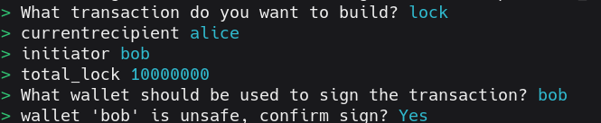
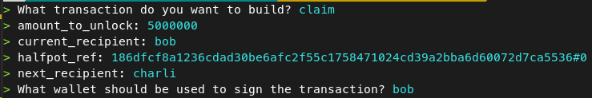

# Vault example

A vault contract, also known as Escrow, is a common type of contract that allows funds to be locked for one or more recipients. The conditions for the release of these funds are business-specific and can be very flexible.

In this example, an Initiator address locks tAda and chooses a Recipient, who is allowed to claim up to half of the funds in the Vault and is also allowed to set a new Recipient.

## Folder structure

```shell
.
├── offchain
│   ├── .env
│   ├── index.ts
│   └── protocol.ts
├── onchain
│   ├── validators
│   │  └── vesting.ak
│   ├── plutus.json
│   └── plutus.ts
├── main.tx3
└── README.md
```


In typical dApp fashion, there is an offchain and an onchain. In the `offchain` directory, we have the code related to building **lock** and **claim** transactions. In the `onchain` directory, we have the validator code that will be used to verify that the transaction is correct on the blockchain.

## Setup for the demo

To run this example we need the toolchain of tx3. You can set everything up following the [tx3up Quick Start Guide][1].
Once this is done, run the bash script at the root of the repository to install the necessary versions:
```bash
$> bash setup.sh
```
The validator compiled code is already included, but to make modifications, you'll need to install [Aiken][2].

We'll be running everything sitting in the [`src`](./) folder.
Once you've installed the tx3 toolchain, you'll run a local devnet for very fast transaction processing. Open a terminal and run:
```bash
$> trix devnet
```

To see what's actually going on in your devnet, run in a second terminal:
```bash
$> trix explore
```

You're now ready to start submitting transactions!.

## Lock in vault

In a different terminal, run the following command to lock funds in the Vesting contract:

```bash
$> trix invoke
```

Select the `lock` transaction providing the following parameters:
* **currentrecipient**: alice
* **initiator**: bob
* **total_lock**: 10000000

Whose wallet do you think must be used for signing the transaction?.

If everything was done correctly, your CLI should look like this:



That's it! Now you can go to the terminal running the devnet explorer to see your transaction.

## Claim half
Go to the Transactions tab in the devnet explorer. You should see one transaction only. Hit Enter to see the details of the tx.
Copy the hash next to the "tx" field, we'll need that to unlock the funds (let's call that LOCKED_UTXO)
Once again, run:
```bash
$> trix invoke
```

Select the `claim` transaction providing the following parameters:
* **current_amount**: 5000000
* **currentrecipient**: alice
* **nextrecipient**: charli
* **vault_ref**: LOCKED_UTXO#0

Your CLI should look like this:



## Resources

Find more on the [Aiken's user manual](https://aiken-lang.org).

[1]: https://docs.txpipe.io/tx3/quick-start
[2]: https://aiken-lang.org
